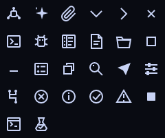

# Icons

Ovim icons are product assets, not convenience glyphs. Strøk source files are authoritative; SVG, sprites, manifests, and PNG review renders are generated artifacts.

## 1. Visual grammar

The selected family is **precision mixed inside an angular-outline contract**:

- Canvas: 24×24 units.
- Normal live area: 2,2 through 22,22.
- Structural stroke: 2 units.
- Line caps: butt.
- Line joins: miter with miter limit 3.
- Primary silhouette: outline.
- Semantic nodes, knobs, AI spark, send, and stop: selective solid fill.
- Color: currentColor only in shipping assets.
- Curves: used only when the object requires them, such as search, status rings, and attachment.
- Perspective: flat orthographic.
- Optical character: compact rails, clear corners, and small filled state nodes.

The family intentionally avoids generic rounded-line softness. Ovim is a precise editing instrument; the angular terminals echo panes, selections, diffs, branches, and cursor geometry.

## 2. Shipping sizes

| Size | Use |
| --- | --- |
| 16px | Tree rows, tabs, status, compact buttons, window controls |
| 20px | Activity rail and primary toolbar |
| 24px | Empty states, onboarding, large action affordances |

Do not ship arbitrary 13px, 15px, or 17px CSS sizes. A 24-unit SVG may render at the supported sizes only after inspection at that size. Keep the viewBox at 0 0 24 24.

The hit area is always larger than the glyph. Icon size is not control size.

## 3. Color and states

- Default icon inherits the surrounding text color.
- Muted applies only to inactive noncritical actions.
- Active navigation uses primary text plus the activity rail; do not recolor the entire glyph accent by default.
- Semantic status icons use error, warning, information, or success.
- Disabled reduces contrast while remaining distinguishable; do not use opacity below 45% on already-muted colors.
- Hover changes the control field first. Recolor only when color adds meaning.
- Badges sit outside the recognition silhouette and never cover a terminal or node.

## 4. Naming

Names describe meaning, not drawing:

- Use source-control, not branch-three-dots.
- Use status-error, not red-circle-x.
- Use ai-spark only for AI entry or action, not generic “magic.”
- Use explorer for the workbench surface; use file and folder for content.

Variants use a stable suffix: chevron-right, status-success, window-restore when a family is clear. Aliases belong in the TypeScript registry, not as duplicate source geometry.

## 5. Strøk workflow

Start each new asset by reading the current icon guide:

~~~sh
strok guide icon
~~~

Create from the selected family profile:

~~~sh
strok new gui-design-guide/icons/src/icon-name.strok --profile icon-outline-angular
~~~

Author meaningful shape and placement names. Add leading meaning and tag comments so the generated registry stays useful:

~~~text
# @meaning Open source control and show repository changes.
# @tags navigation, git, source-control
~~~

Review the icon on both appearances at shipping size and enlarged size:

~~~sh
strok -f gui-design-guide/icons/src/icon-name.strok render \
  --width 16 --color '#c8d3f5' --bg '#090b12' --out /tmp/icon-dark-16.png

strok -f gui-design-guide/icons/src/icon-name.strok render \
  --width 96 --color '#172033' --bg '#f5f7fb' --out /tmp/icon-light-4x.png

strok -f gui-design-guide/icons/src/icon-name.strok audit
~~~

Regenerate the full set:

~~~sh
strok batch gui-design-guide/icons/src \
  --out gui-design-guide/icons/dist \
  --sizes 16,20,24 \
  --color '#c8d3f5' \
  --bg '#090b12' \
  --sprite gui-design-guide/icons/dist/ovim-icons.svg \
  --manifest gui-design-guide/icons/dist/manifest.json \
  --sheet gui-design-guide/icons/dist/contact-sheet.png \
  --columns 6
~~~

Never edit generated SVG or PNG output by hand.

## 6. Quality gates

An icon passes only when:

- Its meaning is recognizable without its label in the actual UI context.
- It remains legible at the smallest shipping size on light and dark backgrounds.
- Its apparent weight matches its neighbors in the contact sheet.
- Its live-area footprint is optically similar to adjacent icons.
- Axis-aligned 2-unit strokes land cleanly.
- It has no accidental kink, clipped miter, doubled edge, false tangent, or crowded interior.
- Mirrored or repeated geometry is generated from shared shapes or repeat constructs.
- It uses currentColor and no theme-specific hard-coded fill.
- Strøk audit findings are resolved or documented as intentional.
- The button has an accessible name even when the SVG is aria-hidden.

Use the contact sheet for family coherence and individual 4× renders for geometry. A contact sheet cannot prove joins are clean; an enlarged render cannot prove 16px recognition.

## 7. Reference set

The included 26-icon family covers:

| Group | Icons |
| --- | --- |
| Navigation | explorer, search, source-control, ai-spark, settings |
| Workbench | command, terminal, test, debug, problems, agent |
| Actions | attach, send, stop |
| Tree and disclosure | file, folder, chevron-right, chevron-down |
| Status | status-error, status-warning, status-info, status-success |
| Window | minimize, maximize, restore, close |

The [generated manifest](icons/dist/manifest.json) is the registry source for names, meanings, tags, canvas, and reviewed sizes.

## 8. Migration from current GUI

| Current implementation | Replacement |
| --- | --- |
| Inline files path | explorer |
| Inline search path | search |
| Inline branch path | source-control |
| Inline spark path | ai-spark |
| Inline gear path | settings |
| Inline min/max/close paths | minimize, maximize/restore, close |
| Tree characters ⌄ and › | chevron-down and chevron-right |
| File dots and folder CSS boxes | file, folder, then language decoration |
| Tab and picker diamond ◇ | file or result-kind icon |
| Diagnostic characters ×, △, • | status-error, status-warning, status-info |
| LSP filter character ⌕ | search |
| Attachment character ▧ | attach |
| Disclosure summary character › | chevron-right with rotation/state |
| CSS spinner made from borders | shared progress indicator; not an icon asset |

The migration must remove the path map from App.tsx and prohibit new text glyph substitutes through review or linting.

## 9. Next inventory

Create these only as the related UI lands:

- Editor actions: split-horizontal, split-vertical, close-pane, wrap, readonly, save.
- Search: replace, match-case, whole-word, regex, include, exclude.
- Source control: changed, added, removed, staged, commit, refresh, publish.
- Debug controls: continue, pause, step-over, step-into, step-out, restart.
- AI actions: copy, retry, edit-queued, remove, context-code, context-image, approval.
- File actions: new-file, new-folder, rename, copy, cut, paste, reveal, trash.
- Navigation: back, forward, symbol, definition, reference.
- Layout: panel-left, panel-right, panel-bottom, collapse-all.

Do not draw the whole speculative inventory in advance. Each icon needs its real control context and neighboring glyphs for optical review.
